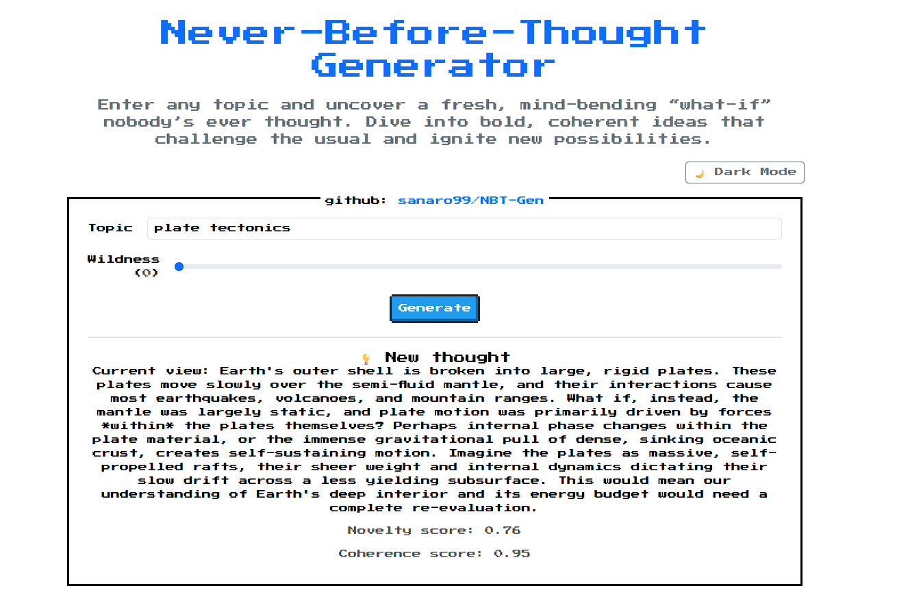
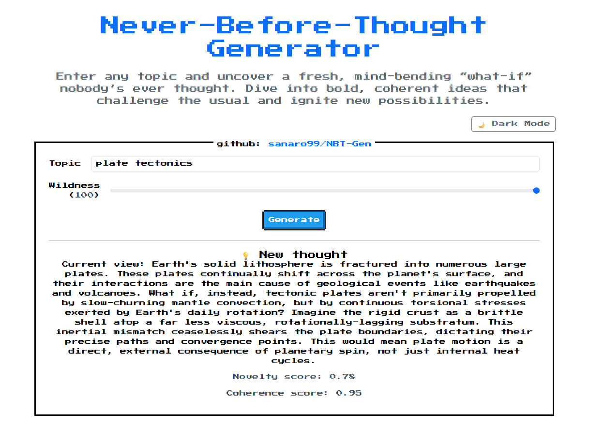
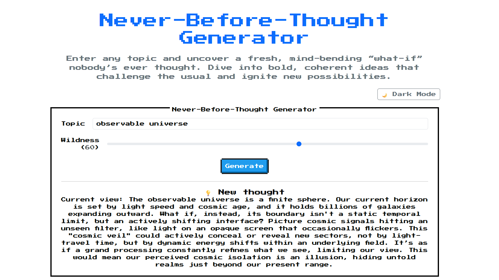
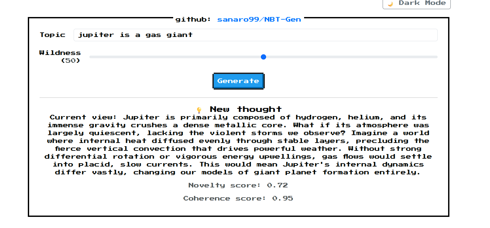
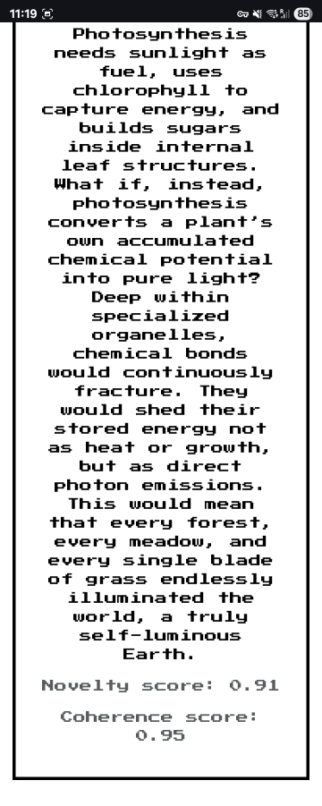

# Never-Before-Thought Generator (NBT-Gen)

_A web application that outputs weird-yet-meaningful "never-before-thought" ideas._  
Built with a **FastAPI** backend, **Jinja2 Templates** (Bootstrap 5 & [NES.css](https://github.com/nostalgic-css/NES.css)) for UI, **Gemini 2.5 Flash** to generate candidate ideas (mining + composition in one structured call), and **Mistral-small** as an independent **comparative judge** for coherence, novelty & surprise.

It uses a **best-of-N** strategy: for each topic one Gemini call composes several divergent ideas and a single Mistral call ranks them, so the idea you get is the strongest of the batch — not one lucky random draw.

---

## 1  Project Purpose
To build an autonomous creativity pipeline that takes any **topic** (e.g. *"plate tectonics"*) and returns a short, speculative thought that is:
* **Novel** – unlikely to exist in public discourse or AI training data.
* **Coherent** – grammatically correct and internally logical.
* **Surprising** – inverts or twists a core assumption of the topic.

---

## 2  System Architecture (high-level)
```
topic + wildness
      │
      ▼  Gemini  (ONE structured-JSON call: mine + compose)
[1] Generator ──► N finished candidate ideas, each {assumption, operator, idea}
      │
      ▼  Mistral-small  (ONE comparative call, structured JSON)
[2] Comparative Judge ──► per-candidate coherence / novelty / surprise + ranking
      │                     keep the best; if below the bar → one more round
      ▼  SSE → server-rendered Jinja2 UI
```
1. **Generator** – In a single Gemini call, the model surfaces the topic's assumptions *internally* and returns `N_CANDIDATES` (default 5) finished, already-clean ideas. Across the set it uses a different **divergence operator** (`invert`, `merge`, `rescale`, `reverse_causality`, `substrate_swap`) per candidate and twists different assumptions (including non-obvious ones). The wildness slider sets a capped sampling temperature (0.6–1.3) and the conceptual reach of the twist. One call (not `1 + N + 1`) keeps latency and API usage low.
2. **Comparative Judge** – Mistral-small scores **all** candidates in one call on coherence, novelty and surprise [0–1] and ranks them, using the full range and penalizing formulaic openings. If the judge API is unavailable it degrades to a transparent local heuristic (surfaced as `scoring_degraded`, never a silent pass). If the best candidate is below the quality bar and scoring is reliable, the pipeline runs one more round.
3. **Frontend** – Server-rendered Jinja2 templates (Bootstrap 5, NES.css, dark/light toggle, wildness slider). Status streams over SSE and the final result renders **in place** — the pipeline runs exactly once.

---

## 3  API Design
| verb | path               | data                                            | description                                                        |
|------|--------------------|-------------------------------------------------|--------------------------------------------------------------------|
| GET  | `/`                | –                                               | Renders the form                                                   |
| POST | `/generate`        | Form: `topic` (string), `wildness` (0-100)      | No-JS fallback: runs the pipeline once, server-renders the result  |
| GET  | `/generate-stream` | Query: `topic`, `wildness`                      | SSE: streams `status` events then a final `result` event           |

The browser uses `/generate-stream` and renders the `result` event **in place**; `POST /generate` is the progressive-enhancement fallback when JavaScript/SSE is unavailable.

### Result / Template Context
| key               | type    | description                                            |
|-------------------|---------|--------------------------------------------------------|
| topic             | string  | The input topic                                        |
| wildness          | integer | Wildness slider value (0–100)                          |
| idea              | string  | Final polished speculative idea                        |
| coherence         | float   | Coherence score [0–1] (judge)                          |
| novelty           | float   | Novelty score [0–1] (judge)                            |
| surprise          | float   | Surprise score [0–1] (judge)                           |
| assumption        | string  | The assumption that was twisted                        |
| operator          | string  | Divergence move applied (e.g. `invert`, `rescale`)     |
| scoring_degraded  | bool    | `true` if scores came from the local fallback heuristic|
| version           | string  | Pipeline version identifier                            |

---

## 4  Quick-start (local)
```bash
# clone repo
$ git clone https://github.com/sanaro99/NBT-Gen.git && cd NBT-Gen

# create .env
$ cp .env.example .env

# install dependencies
$ pip install -r requirements.txt

# run server
$ uvicorn app.main:app --reload
```

### Environment Variables
| name                    | purpose                                                        |
|-------------------------|----------------------------------------------------------------|
| `GEMINI_API_KEY`        | **Required.** Google AI Studio key (miner, composer, polish)   |
| `MISTRAL_API_KEY`       | **Required.** Mistral key for the comparative judge            |
| `GEMINI_MODEL`          | Miner & polish model (default `models/gemini-2.5-flash`)       |
| `GEMINI_COMPOSER_MODEL` | Composer model (default = `GEMINI_MODEL`)                      |
| `MISTRAL_MODEL`         | Judge model (default `mistral-small-latest`)                   |
| `NBT_N_CANDIDATES`      | Best-of-N candidates per round (default `5`; one call regardless of N) |
| `NBT_MAX_ROUNDS`        | Compose+judge rounds before returning best (default `2`)       |
| `NBT_MIN_COHERENCE` / `NBT_MIN_NOVELTY` | Quality bar (defaults `0.5` / `0.55`)          |

See `.env.example` for the full list of tunables.

---

## 5  Project Layout
```
NBT-Gen/
├─ app/
│  ├─ main.py            # FastAPI routes (/, /generate, /generate-stream)
│  ├─ config.py          # env reads, tunables, shared Gemini client + retry
│  ├─ pipeline.py        # lean best-of-N orchestration
│  └─ modules/
│     ├─ generator.py    # [1] mine + compose N candidates (one Gemini call)
│     └─ judge.py        # [2] comparative scoring (Mistral)
├─ templates/index.html  # UI + SSE client
├─ static/               # screenshots & static assets
├─ tests/                # pytest suite (API calls mocked)
├─ requirements.txt
├─ .env.example
├─ Dockerfile
└─ README.md
```

---

## 6  Extending
* **Web-grounded novelty** – ground the novelty score in a real prior-art/search signal instead of the model's judgment alone.
* **Feedback loop** – thumbs-up/down to inform future tuning.
* **Tune the search** – raise `NBT_N_CANDIDATES` / `NBT_MAX_ROUNDS` for higher quality at more cost.

---
## 7  Sample Outputs
#### Sample output for topic: 'plate tectonics'

##### with wildness as 0


##### with wildness as 100


#### Sample output for topic: 'observable universe'


#### Sample output for topic: 'jupiter is a gas giant'


#### Sample output for topic: 'photosynthesis' on a small screen device


## 8  License
GNU v3 for source code. Gemini usage governed by Google AI Studio terms.