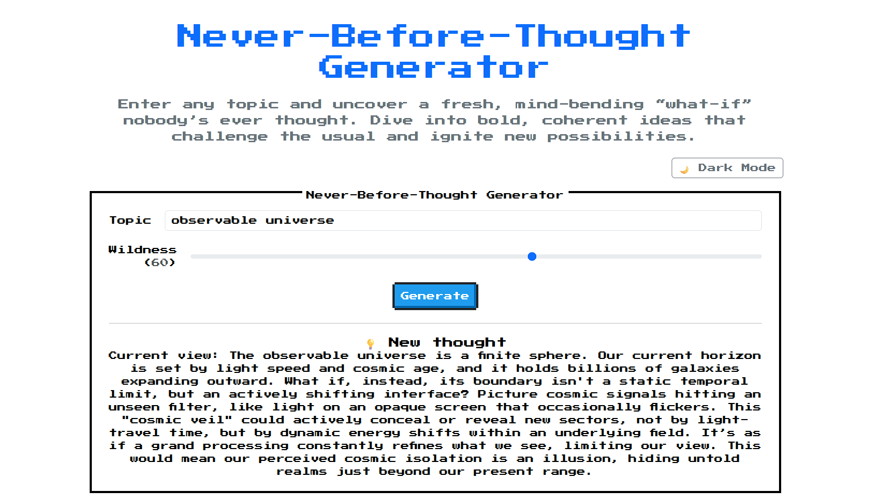

# Never-Before-Thought Generator (NBT-Gen)

_A web application that outputs weird-yet-meaningful "never-before-thought" ideas._  
Built with **FastAPI** backend, **Jinja2 Templates** (Bootstrap 5 & [NES.css](https://github.com/nostalgic-css/NES.css)) for UI, **Gemini 2.5 Flash** for assumption mining, idea composition, and final polish, and **Mistral-small** for coherence & novelty scoring.

---

## 1  Project Purpose
To build an autonomous creativity pipeline that takes any **topic** (e.g. *"plate tectonics"*) and returns a short, speculative thought that is:
* **Novel** – unlikely to exist in public discourse or AI training data.
* **Coherent** – grammatically correct and internally logical.
* **Surprising** – inverts or twists a core assumption of the topic.

---

## 2  System Architecture (high-level)
```
┌────────────┐    ┌──────────────┐    ┌────────────────────┐    ┌───────────────┐
│  FastAPI   │─>──│ Assumption   │─>──│   Divergent Idea   │─>──│   Coherence   │
│  endpoint  │    │  Miner       │    │     Composer       │    │     Filter    │
│  /generate │    │(Gemini Flash)│    │(Gemini Flash, T≈1) │    │(Mistral-small)│
└────────────┘    └──────────────┘    └────────────────────┘    └───────────────┘
                                                                       │
                                                          ┌────────────┴──────────┐
                                                          │     Novelty Scorer    │
                                                          │     (Mistral-small)   │
                                                          └────────────┬──────────┘
                                                                       │
                                                          ┌────────────┴──────────┐
                                                          │ Safety & Final Polish │
                                                          │   (Gemini Flash)      │
                                                          └────────────┬──────────┘
                                                                       │
                                          Server-rendered Web UI via Jinja2 Templates
```
1. **Assumption Miner** – Gemini 2.5 Flash at `temperature≈0` extracts invertible premises — both obvious facts and subtle implicit axioms.  
2. **Divergent Idea Composer** – Gemini 2.5 Flash at `temperature` set by the wildness slider inverts one premise into a vivid, never-before-thought paragraph.  
3. **Coherence Filter** – Mistral-small rates internal logical consistency [0–1]; scores ≥0.3 pass.  
4. **Novelty Scorer** – Mistral-small rates genuine novelty [0–1] — not just unusualness, but "has this been thought before?"  
5. **Safety & Final Polish** – Gemini 2.5 Flash polishes for clarity while preserving the creative soul.  
6. **Frontend** – Server-rendered Jinja2 templates with Bootstrap 5, NES.css, dark/light toggle, and wildness slider.

---

## 3  API Design
| verb | path        | data                         | description                              |
|------|-------------|------------------------------|------------------------------------------|
| POST | `/generate` | Form data: `topic` (string), `wildness` (0-100) | Renders page with generated idea and preserves input |

### Template Context
| key           | type    | description                             |
|---------------|---------|-----------------------------------------|
| topic         | string  | The input topic                         |
| wildness      | integer | Wildness slider value (0–100)           |
| idea          | string  | Generated speculative idea              |
| coherence     | float   | Coherence score [0–1] from Mistral-small|
| novelty       | float   | Novelty score [0–1] from Mistral-small  |
| version       | string  | Pipeline version identifier             |

---

## 4  Quick-start (local)
```bash
# clone repo
$ git clone https://github.com/sanaro99/NBT-Gen.git && cd NBT-Gen

# create .env
$ cp .env.example .env

# install dependencies
$ pip install -r requirements.txt

# run server
$ uvicorn app.main:app --reload
```

### Required Environment Variables
| name                  | purpose                                          |
|-----------------------|--------------------------------------------------|
| `GEMINI_API_KEY`      | Google AI Studio key for Gemini calls            |
| `MISTRAL_API_KEY`     | API key for Mistral Chat coherence & novelty     |
| `GEMINI_MODEL`        | Model for miner & polish (default: `models/gemini-2.5-flash`) |
| `GEMINI_COMPOSER_MODEL` | Model for idea composition (default: `models/gemini-2.5-flash`) |
| `VERCEL_TOKEN`        | (optional) Vercel deploy token for CI/CD         |

---

## 5  Project Layout
```
NBT-Gen/
├─ app/                  # FastAPI modules
├─ templates/            # Jinja2 HTML templates
├─ static/               # CSS & static assets
├─ requirements.txt
├─ .env.example
├─ README.md
└─ Dockerfile
```

---

## 6  Extending
* **Embed feedback loop** – thumbs-up/down to inform future fine-tuning.
* **Add local fallback** – Mistral/phi-2 for offline or quota-safe operation.

---
## 7  Sample Outputs
#### Sample output for topic: 'plate tectonics'

##### with wildness as 0


##### with wildness as 100


#### Sample output for topic: 'observable universe'


#### Sample output for topic: 'jupiter is a gas giant'


#### Sample output for topic: 'photosynthesis' on a small screen device


## 8  License
GNU v3 for source code. Gemini usage governed by Google AI Studio terms.